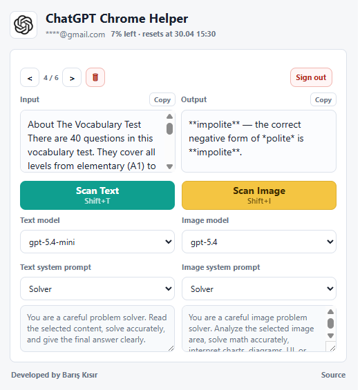

# ChatGPT Chrome Helper

ChatGPT Chrome Helper is a Chrome extension for working with ChatGPT directly from your browser. It can answer selected text, scan page text with local OCR, and analyze selected image areas.

---

## See it in action

## Install

0. Clone or download repository then unzip. https://github.com/bariskisir/ChatGPTChromeHelper/archive/refs/heads/master.zip
1. Open `chrome://extensions`.
2. Enable **Developer mode**.
3. Click **Load unpacked**.
4. Select src folder.

## Login

Open the extension popup and click **Sign in with ChatGPT**. 
You can use it with free subscription.

## Features

- **Ask**: Select text on a page, right-click, and choose **Ask** to send the selected text directly to ChatGPT.
- **Scan Text**: Click **Scan Text** or press **Shift+T** to select a page area, run local OCR with Tesseract, and send only the extracted text to ChatGPT.
- **Scan Image**: Click **Scan Image** or press **Shift+I** to select a page area and send only the selected image to ChatGPT.
- **Area reuse**: The last text and image scan areas are remembered separately. Press **1** to instantly repeat the last text scan, **2** to repeat the last image scan, or use **1** / **Enter** for text and **2** / **Enter** for image inside the overlay to reuse the previous area.
- **History**: Recent inputs and outputs are saved locally with previous/next navigation, copy buttons, and delete history.
- **Models**: Choose separate models for text and image scans. Defaults to `gpt-5.4-mini`; custom model names are supported with **Other**.
- **System prompts**: Choose separate system prompts for text and image scans: **Solver**, **None**, or **Other**.
- **Local storage**: Login tokens, history, scan areas, model choices, and system prompt choices are stored in `chrome.storage.local`.

## Playground

- https://www.oxfordonlineenglish.com/english-level-test/vocabulary

## LICENSE
- MIT
